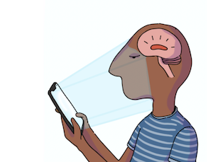

## Light Exposure Behaviour Assessment (LEBA) - English language

### About

The **Light Exposure Behaviour Assessment (LEBA)** instrument is a novel instrument for capturing, assessing and quantifying self-reported behaviours related to light exposure in humans.

### Downloads

[PDF](https://github.com/leba-instrument/leba-instrument-en/tree/main/pdf) ■ [Qualtrics](https://github.com/leba-instrument/leba-instrument-en/tree/main/qualtrics) ■ [REDCap](https://github.com/leba-instrument/leba-instrument-en/tree/main/redcap)

### Release history

[v1.0.1, 6 April 2022](https://github.com/leba-instrument/leba-instrument-en/releases/tag/v1.0.1)  
[v1.0.0, 28 February 2022](https://github.com/leba-instrument/leba-instrument-en/releases/tag/v1.0.0) 

### Citing

If you are using the instrument, please cite the instrument's OSF page ([DOI: 10.17605/OSF.IO/EZ6GJ](https://doi.org/10.17605/OSF.IO/EZ6GJ)) as well as our preprint on the topic:

> Siraji, M. A., Lazar, R., van Duijnhoven, J., Schlangen, L., Haque, S., Kalavally, V., Vetter, C., Glickman, G., Smolders, K., & Spitschan, M. (2022). Light Exposure Behaviour Assessment (LEBA) instrument (English language), v1.0.1. Retrieved from osf.io/ez6gj. DOI: 10.17605/OSF.IO/EZ6GJ.

### Instructions

LEBA captures light exposure-related behaviours on a 5 point Likert type scale ranging from 1 to 5 (1 = never; 2 = rarely; 3 = sometimes; 4 = often; 5 = always). The score of each factor is calculated by the summation of scores of items belonging to the corresponding factor. Respondends are requested to respond to each item in a retrospective manner where they try to capture their propensity of different light exposure related behaviors in the **past 4 weeks.**

### Key links

- [Main GitHub organisation](https://github.com/leba-instrument/)
- [OSF page with archival and version-stamped releases (DOI: 10.17605/OSF.IO/EZ6GJ)](https://doi.org/10.17605/OSF.IO/EZ6GJ)
- [GitHub repository of the instrument](https://github.com/leba-instrument/leba-instrument-en)
- [GitHub repository of the reproducible manuscript](https://github.com/leba-instrument/leba-manuscript)
- [This website](leba-instrument.org) and [repository for this website](https://github.com/leba-instrument/leba-instrument.github.io)

### License

The Light Exposure Behaviour Assessment (LEBA) instrument is released under the [CC-BY-NC-ND (Creative Commons Attribution-NonCommercial-NoDerivatives 4.0 International) International License](https://creativecommons.org/licenses/by-nc-nd/4.0/).

### Contributing and translations

We welcome translations of the LEBA instrument, under the conditions of the [CC-BY-NC-ND (Creative Commons Attribution-NonCommercial-NoDerivatives 4.0 International) International License](https://creativecommons.org/licenses/by-nc-nd/4.0/).

### Contact

For any questions regarding translations, please email [Prof. Dr. Manuel Spitschan](mailto:manuel.spitschan@tum.de).

### List of publications using the LEBA instrument

This list gives an overview of publications using the LEBA instrument.
